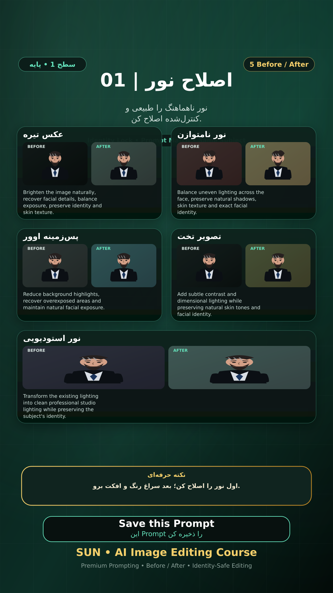

# Story 01 — اصلاح نور

**موضوع:** نور ناهماهنگ را طبیعی و کنترل‌شده اصلاح کن.

## زمان انتشار
- Instagram: `h.alavian`
- نوع: `Story`
- زمان: `2026-09-17 00:00` به وقت ایران (Asia/Tehran)
- انتشار خودکار: فعال
- محتوای تولید/ویرایش‌شده با AI: بله

## قانون ثابت هویت چهره
> Use the uploaded reference image as the permanent identity anchor. Preserve the exact facial identity, facial structure, proportions, eye shape, eyebrows, nose, lips, jawline, chin, skin tone, apparent age and distinctive facial characteristics. The person must remain instantly recognizable as the same individual. Do not alter identity, ethnicity, age or face shape. Change only the explicitly requested elements.

## پرامپت‌های استفاده‌شده در استوری
1. **عکس تیره:** `Brighten the image naturally, recover facial details, balance exposure, preserve identity and skin texture.`
2. **نور نامتوازن:** `Balance uneven lighting across the face, preserve natural shadows, skin texture and exact facial identity.`
3. **پس‌زمینه اوور:** `Reduce background highlights, recover overexposed areas and maintain natural facial exposure.`
4. **تصویر تخت:** `Add subtle contrast and dimensional lighting while preserving natural skin tones and facial identity.`
5. **نور استودیویی:** `Transform the existing lighting into clean professional studio lighting while preserving the subject's identity.`

> نکته: اول نور را اصلاح کن؛ بعد سراغ رنگ و افکت برو.
