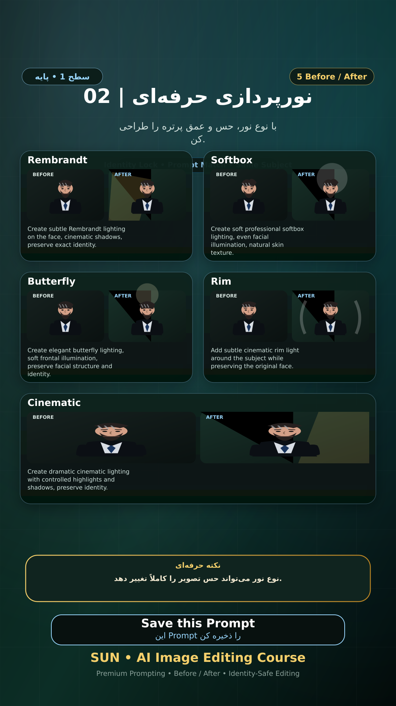

# Story 02 — نورپردازی حرفه‌ای

**موضوع:** با نوع نور، حس و عمق پرتره را طراحی کن.

## زمان انتشار
- Instagram: `h.alavian`
- نوع: `Story`
- زمان: `2026-09-17 00:00` به وقت ایران (Asia/Tehran)
- انتشار خودکار: فعال
- محتوای تولید/ویرایش‌شده با AI: بله

## قانون ثابت هویت چهره
> Use the uploaded reference image as the permanent identity anchor. Preserve the exact facial identity, facial structure, proportions, eye shape, eyebrows, nose, lips, jawline, chin, skin tone, apparent age and distinctive facial characteristics. The person must remain instantly recognizable as the same individual. Do not alter identity, ethnicity, age or face shape. Change only the explicitly requested elements.

## پرامپت‌های استفاده‌شده در استوری
1. **Rembrandt:** `Create subtle Rembrandt lighting on the face, cinematic shadows, preserve exact identity.`
2. **Softbox:** `Create soft professional softbox lighting, even facial illumination, natural skin texture.`
3. **Butterfly:** `Create elegant butterfly lighting, soft frontal illumination, preserve facial structure and identity.`
4. **Rim:** `Add subtle cinematic rim light around the subject while preserving the original face.`
5. **Cinematic:** `Create dramatic cinematic lighting with controlled highlights and shadows, preserve identity.`

> نکته: نوع نور می‌تواند حس تصویر را کاملاً تغییر دهد.
