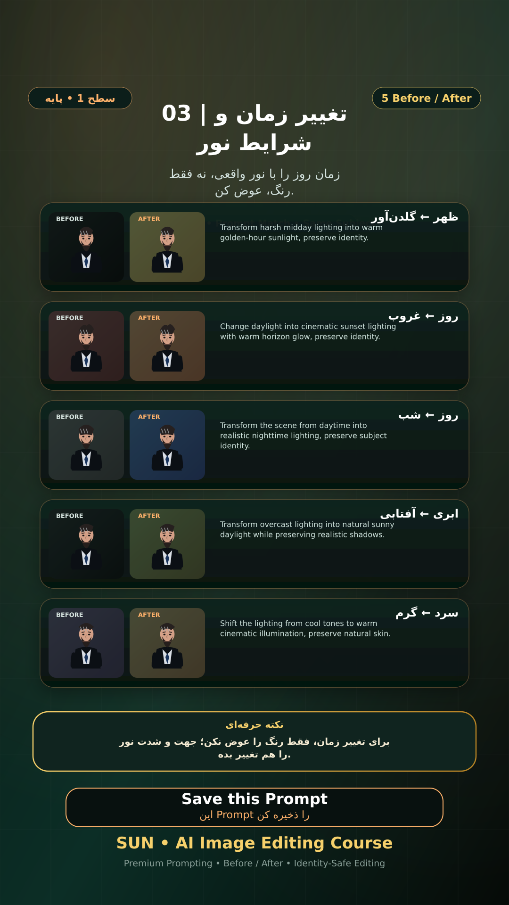

# Story 03 — تغییر زمان و شرایط نور

**موضوع:** زمان روز را با نور واقعی، نه فقط رنگ، عوض کن.

## زمان انتشار
- Instagram: `h.alavian`
- نوع: `Story`
- زمان: `2026-09-17 00:00` به وقت ایران (Asia/Tehran)
- انتشار خودکار: فعال
- محتوای تولید/ویرایش‌شده با AI: بله

## قانون ثابت هویت چهره
> Use the uploaded reference image as the permanent identity anchor. Preserve the exact facial identity, facial structure, proportions, eye shape, eyebrows, nose, lips, jawline, chin, skin tone, apparent age and distinctive facial characteristics. The person must remain instantly recognizable as the same individual. Do not alter identity, ethnicity, age or face shape. Change only the explicitly requested elements.

## پرامپت‌های استفاده‌شده در استوری
1. **ظهر ← گلدن‌آور:** `Transform harsh midday lighting into warm golden-hour sunlight, preserve identity.`
2. **روز ← غروب:** `Change daylight into cinematic sunset lighting with warm horizon glow, preserve identity.`
3. **روز ← شب:** `Transform the scene from daytime into realistic nighttime lighting, preserve subject identity.`
4. **ابری ← آفتابی:** `Transform overcast lighting into natural sunny daylight while preserving realistic shadows.`
5. **سرد ← گرم:** `Shift the lighting from cool tones to warm cinematic illumination, preserve natural skin.`

> نکته: برای تغییر زمان، فقط رنگ را عوض نکن؛ جهت و شدت نور را هم تغییر بده.
