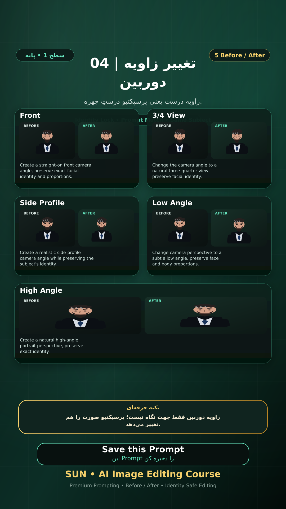

# Story 04 — تغییر زاویه دوربین

**موضوع:** زاویه درست یعنی پرسپکتیو درستِ چهره.

## زمان انتشار
- Instagram: `h.alavian`
- نوع: `Story`
- زمان: `2026-09-17 00:00` به وقت ایران (Asia/Tehran)
- انتشار خودکار: فعال
- محتوای تولید/ویرایش‌شده با AI: بله

## قانون ثابت هویت چهره
> Use the uploaded reference image as the permanent identity anchor. Preserve the exact facial identity, facial structure, proportions, eye shape, eyebrows, nose, lips, jawline, chin, skin tone, apparent age and distinctive facial characteristics. The person must remain instantly recognizable as the same individual. Do not alter identity, ethnicity, age or face shape. Change only the explicitly requested elements.

## پرامپت‌های استفاده‌شده در استوری
1. **Front:** `Create a straight-on front camera angle, preserve exact facial identity and proportions.`
2. **3/4 View:** `Change the camera angle to a natural three-quarter view, preserve facial identity.`
3. **Side Profile:** `Create a realistic side-profile camera angle while preserving the subject's identity.`
4. **Low Angle:** `Change camera perspective to a subtle low angle, preserve face and body proportions.`
5. **High Angle:** `Create a natural high-angle portrait perspective, preserve exact identity.`

> نکته: زاویه دوربین فقط جهت نگاه نیست؛ پرسپکتیو صورت را هم تغییر می‌دهد.
