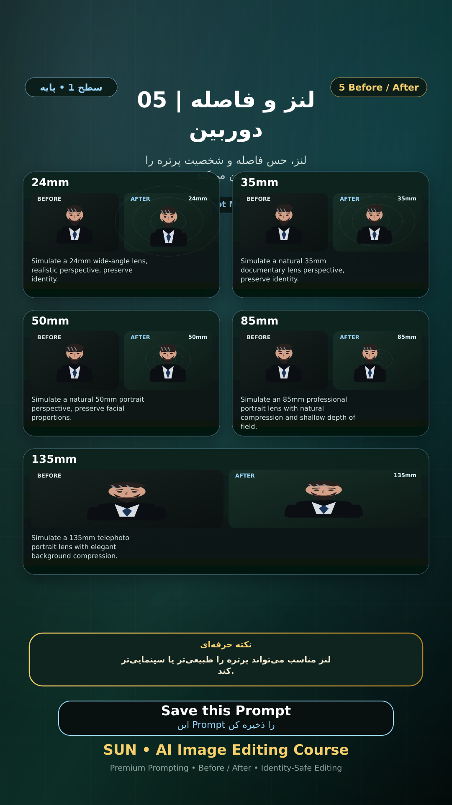

# Story 05 — لنز و فاصله دوربین

**موضوع:** لنز، حس فاصله و شخصیت پرتره را تعیین می‌کند.

## زمان انتشار
- Instagram: `h.alavian`
- نوع: `Story`
- زمان: `2026-09-17 00:00` به وقت ایران (Asia/Tehran)
- انتشار خودکار: فعال
- محتوای تولید/ویرایش‌شده با AI: بله

## قانون ثابت هویت چهره
> Use the uploaded reference image as the permanent identity anchor. Preserve the exact facial identity, facial structure, proportions, eye shape, eyebrows, nose, lips, jawline, chin, skin tone, apparent age and distinctive facial characteristics. The person must remain instantly recognizable as the same individual. Do not alter identity, ethnicity, age or face shape. Change only the explicitly requested elements.

## پرامپت‌های استفاده‌شده در استوری
1. **24mm:** `Simulate a 24mm wide-angle lens, realistic perspective, preserve identity.`
2. **35mm:** `Simulate a natural 35mm documentary lens perspective, preserve identity.`
3. **50mm:** `Simulate a natural 50mm portrait perspective, preserve facial proportions.`
4. **85mm:** `Simulate an 85mm professional portrait lens with natural compression and shallow depth of field.`
5. **135mm:** `Simulate a 135mm telephoto portrait lens with elegant background compression.`

> نکته: لنز مناسب می‌تواند پرتره را طبیعی‌تر یا سینمایی‌تر کند.
