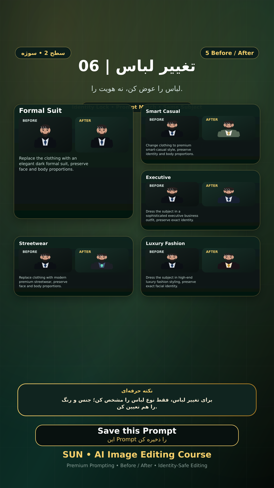

# Story 06 — تغییر لباس

**موضوع:** لباس را عوض کن، نه هویت را.

## زمان انتشار
- Instagram: `h.alavian`
- نوع: `Story`
- زمان: `2026-09-17 00:00` به وقت ایران (Asia/Tehran)
- انتشار خودکار: فعال
- محتوای تولید/ویرایش‌شده با AI: بله

## قانون ثابت هویت چهره
> Use the uploaded reference image as the permanent identity anchor. Preserve the exact facial identity, facial structure, proportions, eye shape, eyebrows, nose, lips, jawline, chin, skin tone, apparent age and distinctive facial characteristics. The person must remain instantly recognizable as the same individual. Do not alter identity, ethnicity, age or face shape. Change only the explicitly requested elements.

## پرامپت‌های استفاده‌شده در استوری
1. **Formal Suit:** `Replace the clothing with an elegant dark formal suit, preserve face and body proportions.`
2. **Smart Casual:** `Change clothing to premium smart-casual style, preserve identity and body proportions.`
3. **Executive:** `Dress the subject in a sophisticated executive business outfit, preserve exact identity.`
4. **Streetwear:** `Replace clothing with modern premium streetwear, preserve face and body proportions.`
5. **Luxury Fashion:** `Dress the subject in high-end luxury fashion styling, preserve exact facial identity.`

> نکته: برای تغییر لباس، فقط نوع لباس را مشخص کن؛ جنس و رنگ را هم تعیین کن.
