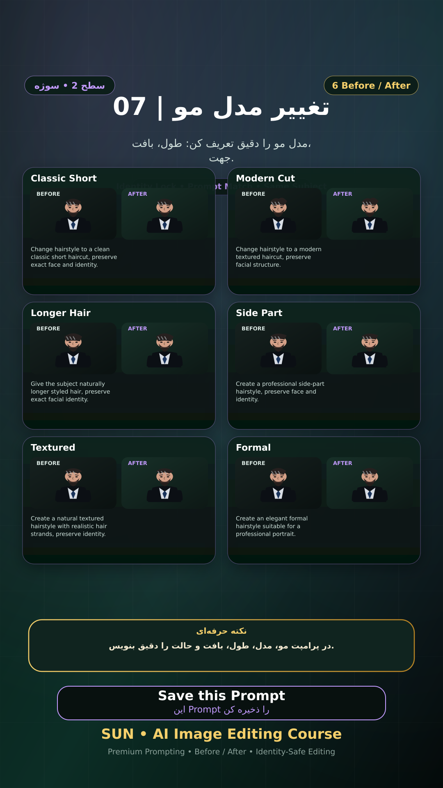

# Story 07 — تغییر مدل مو

**موضوع:** مدل مو را دقیق تعریف کن: طول، بافت، جهت.

## زمان انتشار
- Instagram: `h.alavian`
- نوع: `Story`
- زمان: `2026-09-17 00:00` به وقت ایران (Asia/Tehran)
- انتشار خودکار: فعال
- محتوای تولید/ویرایش‌شده با AI: بله

## قانون ثابت هویت چهره
> Use the uploaded reference image as the permanent identity anchor. Preserve the exact facial identity, facial structure, proportions, eye shape, eyebrows, nose, lips, jawline, chin, skin tone, apparent age and distinctive facial characteristics. The person must remain instantly recognizable as the same individual. Do not alter identity, ethnicity, age or face shape. Change only the explicitly requested elements.

## پرامپت‌های استفاده‌شده در استوری
1. **Classic Short:** `Change hairstyle to a clean classic short haircut, preserve exact face and identity.`
2. **Modern Cut:** `Change hairstyle to a modern textured haircut, preserve facial structure.`
3. **Longer Hair:** `Give the subject naturally longer styled hair, preserve exact facial identity.`
4. **Side Part:** `Create a professional side-part hairstyle, preserve face and identity.`
5. **Textured:** `Create a natural textured hairstyle with realistic hair strands, preserve identity.`
6. **Formal:** `Create an elegant formal hairstyle suitable for a professional portrait.`

> نکته: در پرامپت مو، مدل، طول، بافت و حالت را دقیق بنویس.
