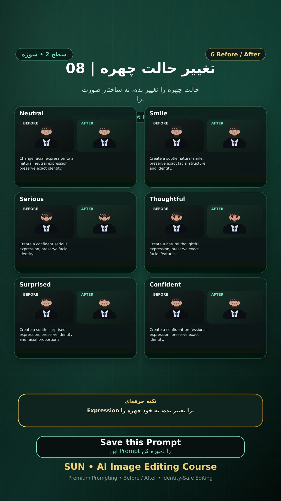

# Story 08 — تغییر حالت چهره

**موضوع:** حالت چهره را تغییر بده، نه ساختار صورت را.

## زمان انتشار
- Instagram: `h.alavian`
- نوع: `Story`
- زمان: `2026-09-17 00:00` به وقت ایران (Asia/Tehran)
- انتشار خودکار: فعال
- محتوای تولید/ویرایش‌شده با AI: بله

## قانون ثابت هویت چهره
> Use the uploaded reference image as the permanent identity anchor. Preserve the exact facial identity, facial structure, proportions, eye shape, eyebrows, nose, lips, jawline, chin, skin tone, apparent age and distinctive facial characteristics. The person must remain instantly recognizable as the same individual. Do not alter identity, ethnicity, age or face shape. Change only the explicitly requested elements.

## پرامپت‌های استفاده‌شده در استوری
1. **Neutral:** `Change facial expression to a natural neutral expression, preserve exact identity.`
2. **Smile:** `Create a subtle natural smile, preserve exact facial structure and identity.`
3. **Serious:** `Create a confident serious expression, preserve facial identity.`
4. **Thoughtful:** `Create a natural thoughtful expression, preserve exact facial features.`
5. **Surprised:** `Create a subtle surprised expression, preserve identity and facial proportions.`
6. **Confident:** `Create a confident professional expression, preserve exact identity.`

> نکته: Expression را تغییر بده، نه خود چهره را.
