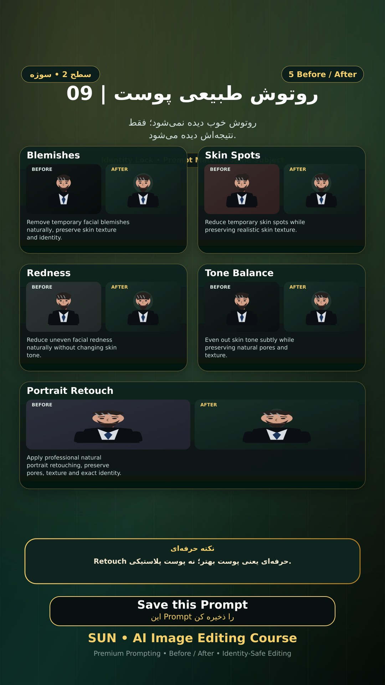

# Story 09 — روتوش طبیعی پوست

**موضوع:** روتوش خوب دیده نمی‌شود؛ فقط نتیجه‌اش دیده می‌شود.

## زمان انتشار
- Instagram: `h.alavian`
- نوع: `Story`
- زمان: `2026-09-17 00:00` به وقت ایران (Asia/Tehran)
- انتشار خودکار: فعال
- محتوای تولید/ویرایش‌شده با AI: بله

## قانون ثابت هویت چهره
> Use the uploaded reference image as the permanent identity anchor. Preserve the exact facial identity, facial structure, proportions, eye shape, eyebrows, nose, lips, jawline, chin, skin tone, apparent age and distinctive facial characteristics. The person must remain instantly recognizable as the same individual. Do not alter identity, ethnicity, age or face shape. Change only the explicitly requested elements.

## پرامپت‌های استفاده‌شده در استوری
1. **Blemishes:** `Remove temporary facial blemishes naturally, preserve skin texture and identity.`
2. **Skin Spots:** `Reduce temporary skin spots while preserving realistic skin texture.`
3. **Redness:** `Reduce uneven facial redness naturally without changing skin tone.`
4. **Tone Balance:** `Even out skin tone subtly while preserving natural pores and texture.`
5. **Portrait Retouch:** `Apply professional natural portrait retouching, preserve pores, texture and exact identity.`

> نکته: Retouch حرفه‌ای یعنی پوست بهتر؛ نه پوست پلاستیکی.
