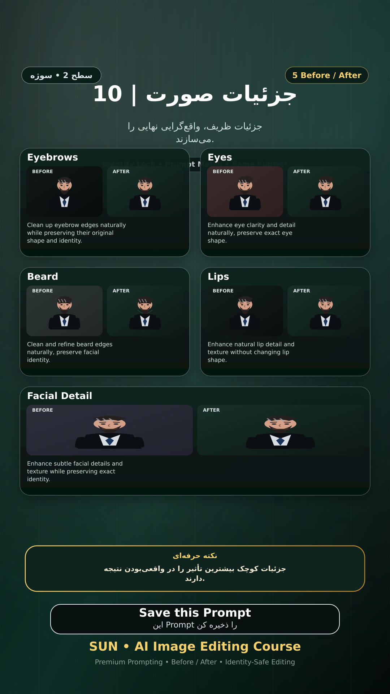

# Story 10 — جزئیات صورت

**موضوع:** جزئیات ظریف، واقع‌گرایی نهایی را می‌سازند.

## زمان انتشار
- Instagram: `h.alavian`
- نوع: `Story`
- زمان: `2026-09-17 00:00` به وقت ایران (Asia/Tehran)
- انتشار خودکار: فعال
- محتوای تولید/ویرایش‌شده با AI: بله

## قانون ثابت هویت چهره
> Use the uploaded reference image as the permanent identity anchor. Preserve the exact facial identity, facial structure, proportions, eye shape, eyebrows, nose, lips, jawline, chin, skin tone, apparent age and distinctive facial characteristics. The person must remain instantly recognizable as the same individual. Do not alter identity, ethnicity, age or face shape. Change only the explicitly requested elements.

## پرامپت‌های استفاده‌شده در استوری
1. **Eyebrows:** `Clean up eyebrow edges naturally while preserving their original shape and identity.`
2. **Eyes:** `Enhance eye clarity and detail naturally, preserve exact eye shape.`
3. **Beard:** `Clean and refine beard edges naturally, preserve facial identity.`
4. **Lips:** `Enhance natural lip detail and texture without changing lip shape.`
5. **Facial Detail:** `Enhance subtle facial details and texture while preserving exact identity.`

> نکته: جزئیات کوچک بیشترین تأثیر را در واقعی‌بودن نتیجه دارند.
