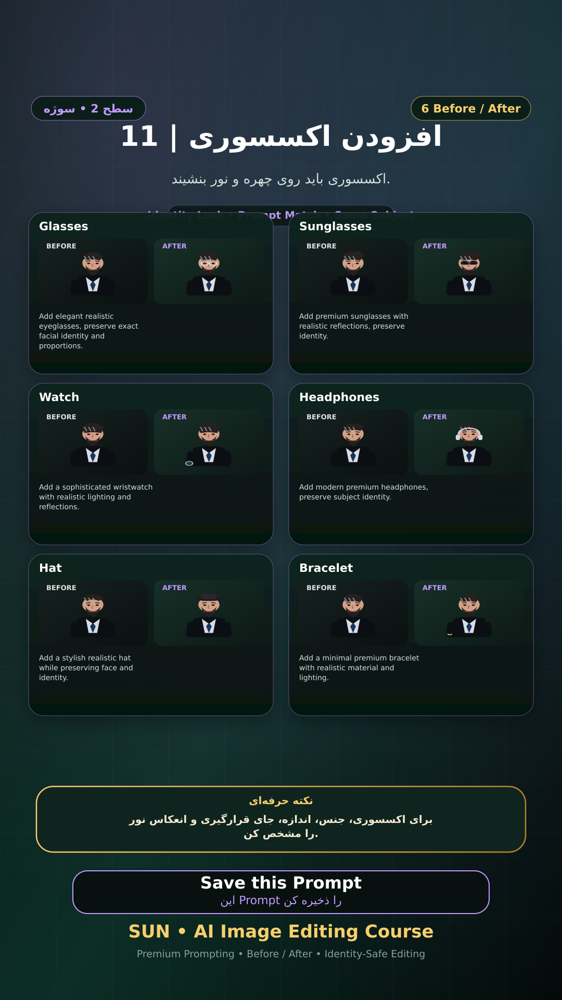

# Story 11 — افزودن اکسسوری

**موضوع:** اکسسوری باید روی چهره و نور بنشیند.

## زمان انتشار
- Instagram: `h.alavian`
- نوع: `Story`
- زمان: `2026-09-17 00:00` به وقت ایران (Asia/Tehran)
- انتشار خودکار: فعال
- محتوای تولید/ویرایش‌شده با AI: بله

## قانون ثابت هویت چهره
> Use the uploaded reference image as the permanent identity anchor. Preserve the exact facial identity, facial structure, proportions, eye shape, eyebrows, nose, lips, jawline, chin, skin tone, apparent age and distinctive facial characteristics. The person must remain instantly recognizable as the same individual. Do not alter identity, ethnicity, age or face shape. Change only the explicitly requested elements.

## پرامپت‌های استفاده‌شده در استوری
1. **Glasses:** `Add elegant realistic eyeglasses, preserve exact facial identity and proportions.`
2. **Sunglasses:** `Add premium sunglasses with realistic reflections, preserve identity.`
3. **Watch:** `Add a sophisticated wristwatch with realistic lighting and reflections.`
4. **Headphones:** `Add modern premium headphones, preserve subject identity.`
5. **Hat:** `Add a stylish realistic hat while preserving face and identity.`
6. **Bracelet:** `Add a minimal premium bracelet with realistic material and lighting.`

> نکته: برای اکسسوری، جنس، اندازه، جای قرارگیری و انعکاس نور را مشخص کن.
