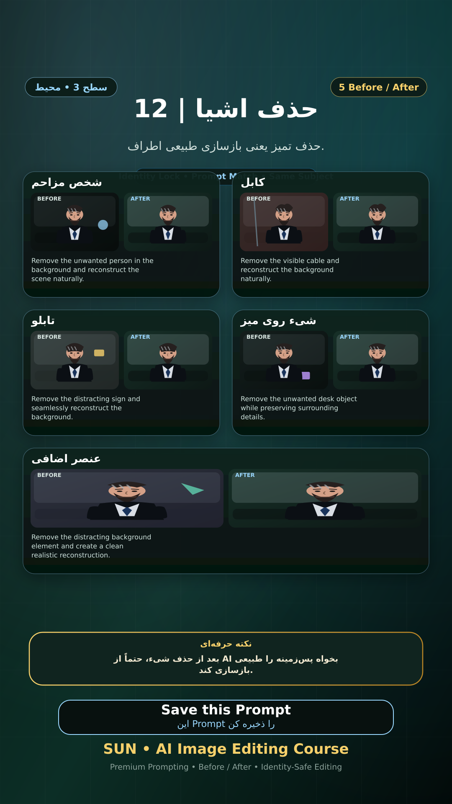

# Story 12 — حذف اشیا

**موضوع:** حذف تمیز یعنی بازسازی طبیعی اطراف.

## زمان انتشار
- Instagram: `h.alavian`
- نوع: `Story`
- زمان: `2026-09-17 00:00` به وقت ایران (Asia/Tehran)
- انتشار خودکار: فعال
- محتوای تولید/ویرایش‌شده با AI: بله

## قانون ثابت هویت چهره
> Use the uploaded reference image as the permanent identity anchor. Preserve the exact facial identity, facial structure, proportions, eye shape, eyebrows, nose, lips, jawline, chin, skin tone, apparent age and distinctive facial characteristics. The person must remain instantly recognizable as the same individual. Do not alter identity, ethnicity, age or face shape. Change only the explicitly requested elements.

## پرامپت‌های استفاده‌شده در استوری
1. **شخص مزاحم:** `Remove the unwanted person in the background and reconstruct the scene naturally.`
2. **کابل:** `Remove the visible cable and reconstruct the background naturally.`
3. **تابلو:** `Remove the distracting sign and seamlessly reconstruct the background.`
4. **شیء روی میز:** `Remove the unwanted desk object while preserving surrounding details.`
5. **عنصر اضافی:** `Remove the distracting background element and create a clean realistic reconstruction.`

> نکته: بعد از حذف شیء، حتماً از AI بخواه پس‌زمینه را طبیعی بازسازی کند.
