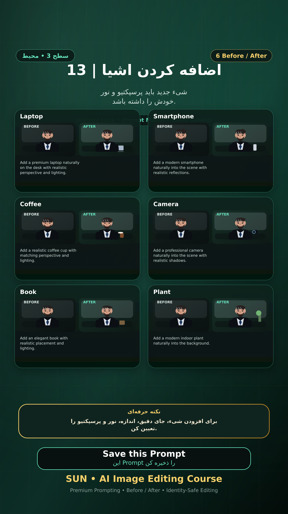

# Story 13 — اضافه کردن اشیا

**موضوع:** شیء جدید باید پرسپکتیو و نور خودش را داشته باشد.

## زمان انتشار
- Instagram: `h.alavian`
- نوع: `Story`
- زمان: `2026-09-17 00:00` به وقت ایران (Asia/Tehran)
- انتشار خودکار: فعال
- محتوای تولید/ویرایش‌شده با AI: بله

## قانون ثابت هویت چهره
> Use the uploaded reference image as the permanent identity anchor. Preserve the exact facial identity, facial structure, proportions, eye shape, eyebrows, nose, lips, jawline, chin, skin tone, apparent age and distinctive facial characteristics. The person must remain instantly recognizable as the same individual. Do not alter identity, ethnicity, age or face shape. Change only the explicitly requested elements.

## پرامپت‌های استفاده‌شده در استوری
1. **Laptop:** `Add a premium laptop naturally on the desk with realistic perspective and lighting.`
2. **Smartphone:** `Add a modern smartphone naturally into the scene with realistic reflections.`
3. **Coffee:** `Add a realistic coffee cup with matching perspective and lighting.`
4. **Camera:** `Add a professional camera naturally into the scene with realistic shadows.`
5. **Book:** `Add an elegant book with realistic placement and lighting.`
6. **Plant:** `Add a modern indoor plant naturally into the background.`

> نکته: برای افزودن شیء، جای دقیق، اندازه، نور و پرسپکتیو را تعیین کن.
