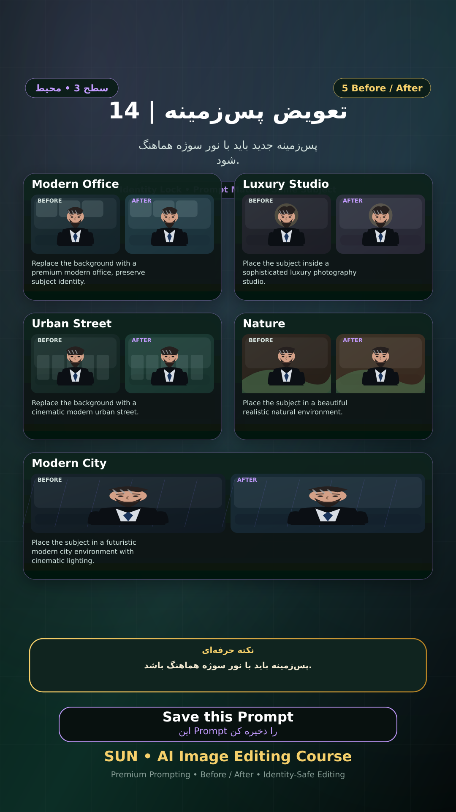

# Story 14 — تعویض پس‌زمینه

**موضوع:** پس‌زمینه جدید باید با نور سوژه هماهنگ شود.

## زمان انتشار
- Instagram: `h.alavian`
- نوع: `Story`
- زمان: `2026-09-17 00:00` به وقت ایران (Asia/Tehran)
- انتشار خودکار: فعال
- محتوای تولید/ویرایش‌شده با AI: بله

## قانون ثابت هویت چهره
> Use the uploaded reference image as the permanent identity anchor. Preserve the exact facial identity, facial structure, proportions, eye shape, eyebrows, nose, lips, jawline, chin, skin tone, apparent age and distinctive facial characteristics. The person must remain instantly recognizable as the same individual. Do not alter identity, ethnicity, age or face shape. Change only the explicitly requested elements.

## پرامپت‌های استفاده‌شده در استوری
1. **Modern Office:** `Replace the background with a premium modern office, preserve subject identity.`
2. **Luxury Studio:** `Place the subject inside a sophisticated luxury photography studio.`
3. **Urban Street:** `Replace the background with a cinematic modern urban street.`
4. **Nature:** `Place the subject in a beautiful realistic natural environment.`
5. **Modern City:** `Place the subject in a futuristic modern city environment with cinematic lighting.`

> نکته: پس‌زمینه باید با نور سوژه هماهنگ باشد.
