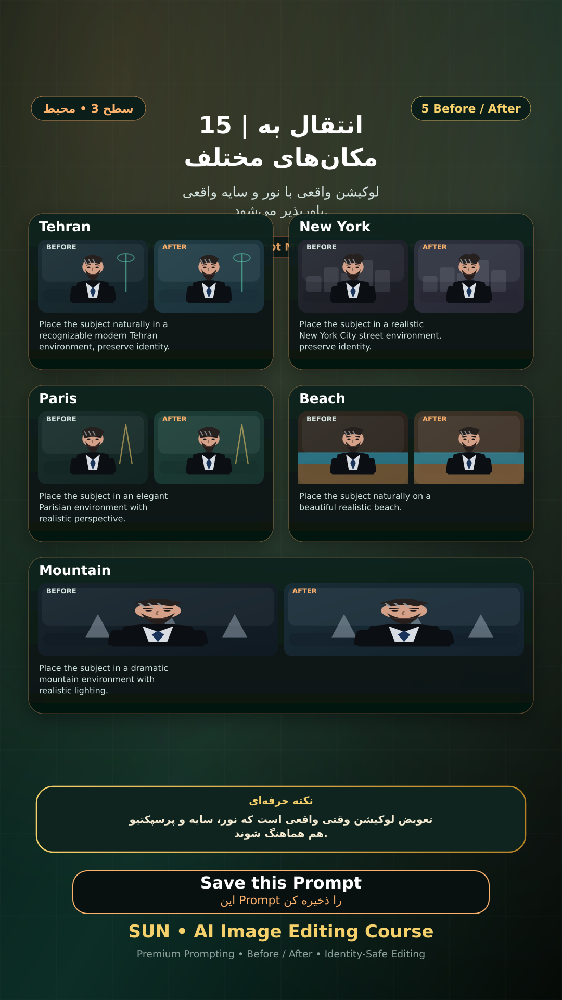

# Story 15 — انتقال به مکان‌های مختلف

**موضوع:** لوکیشن واقعی با نور و سایه واقعی باورپذیر می‌شود.

## زمان انتشار
- Instagram: `h.alavian`
- نوع: `Story`
- زمان: `2026-09-17 00:00` به وقت ایران (Asia/Tehran)
- انتشار خودکار: فعال
- محتوای تولید/ویرایش‌شده با AI: بله

## قانون ثابت هویت چهره
> Use the uploaded reference image as the permanent identity anchor. Preserve the exact facial identity, facial structure, proportions, eye shape, eyebrows, nose, lips, jawline, chin, skin tone, apparent age and distinctive facial characteristics. The person must remain instantly recognizable as the same individual. Do not alter identity, ethnicity, age or face shape. Change only the explicitly requested elements.

## پرامپت‌های استفاده‌شده در استوری
1. **Tehran:** `Place the subject naturally in a recognizable modern Tehran environment, preserve identity.`
2. **New York:** `Place the subject in a realistic New York City street environment, preserve identity.`
3. **Paris:** `Place the subject in an elegant Parisian environment with realistic perspective.`
4. **Beach:** `Place the subject naturally on a beautiful realistic beach.`
5. **Mountain:** `Place the subject in a dramatic mountain environment with realistic lighting.`

> نکته: تعویض لوکیشن وقتی واقعی است که نور، سایه و پرسپکتیو هم هماهنگ شوند.
