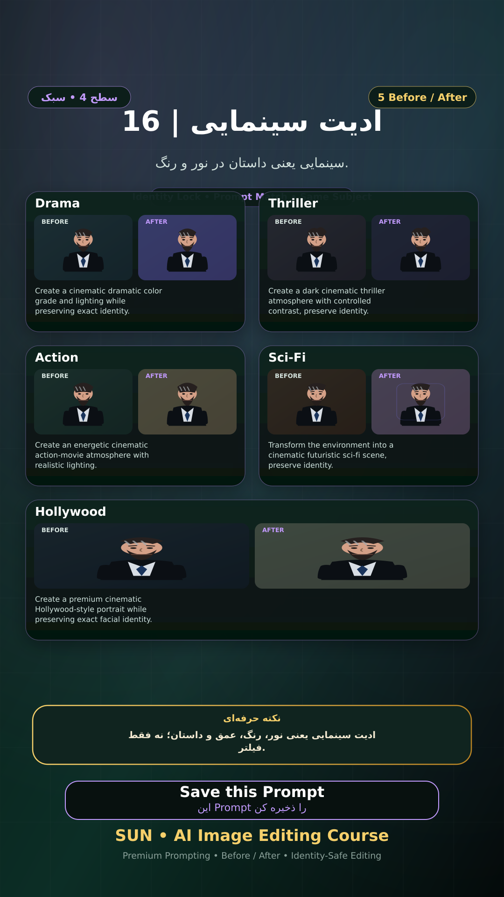

# Story 16 — ادیت سینمایی

**موضوع:** سینمایی یعنی داستان در نور و رنگ.

## زمان انتشار
- Instagram: `h.alavian`
- نوع: `Story`
- زمان: `2026-09-17 00:00` به وقت ایران (Asia/Tehran)
- انتشار خودکار: فعال
- محتوای تولید/ویرایش‌شده با AI: بله

## قانون ثابت هویت چهره
> Use the uploaded reference image as the permanent identity anchor. Preserve the exact facial identity, facial structure, proportions, eye shape, eyebrows, nose, lips, jawline, chin, skin tone, apparent age and distinctive facial characteristics. The person must remain instantly recognizable as the same individual. Do not alter identity, ethnicity, age or face shape. Change only the explicitly requested elements.

## پرامپت‌های استفاده‌شده در استوری
1. **Drama:** `Create a cinematic dramatic color grade and lighting while preserving exact identity.`
2. **Thriller:** `Create a dark cinematic thriller atmosphere with controlled contrast, preserve identity.`
3. **Action:** `Create an energetic cinematic action-movie atmosphere with realistic lighting.`
4. **Sci-Fi:** `Transform the environment into a cinematic futuristic sci-fi scene, preserve identity.`
5. **Hollywood:** `Create a premium cinematic Hollywood-style portrait while preserving exact facial identity.`

> نکته: ادیت سینمایی یعنی نور، رنگ، عمق و داستان؛ نه فقط فیلتر.
