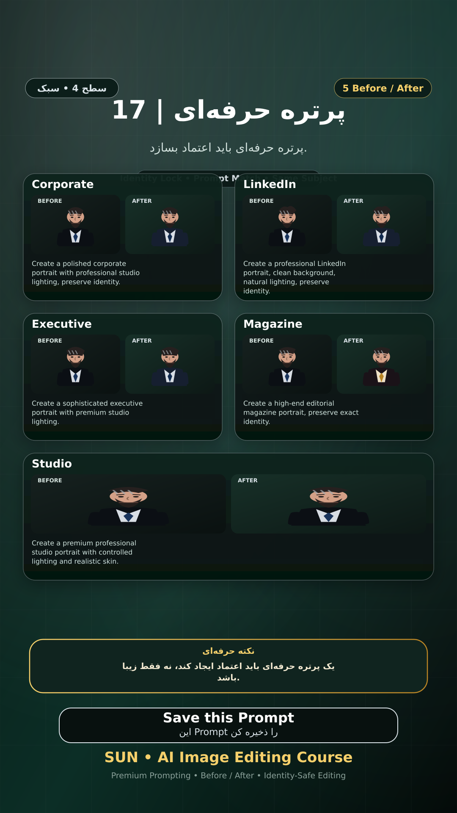

# Story 17 — پرتره حرفه‌ای

**موضوع:** پرتره حرفه‌ای باید اعتماد بسازد.

## زمان انتشار
- Instagram: `h.alavian`
- نوع: `Story`
- زمان: `2026-09-17 00:00` به وقت ایران (Asia/Tehran)
- انتشار خودکار: فعال
- محتوای تولید/ویرایش‌شده با AI: بله

## قانون ثابت هویت چهره
> Use the uploaded reference image as the permanent identity anchor. Preserve the exact facial identity, facial structure, proportions, eye shape, eyebrows, nose, lips, jawline, chin, skin tone, apparent age and distinctive facial characteristics. The person must remain instantly recognizable as the same individual. Do not alter identity, ethnicity, age or face shape. Change only the explicitly requested elements.

## پرامپت‌های استفاده‌شده در استوری
1. **Corporate:** `Create a polished corporate portrait with professional studio lighting, preserve identity.`
2. **LinkedIn:** `Create a professional LinkedIn portrait, clean background, natural lighting, preserve identity.`
3. **Executive:** `Create a sophisticated executive portrait with premium studio lighting.`
4. **Magazine:** `Create a high-end editorial magazine portrait, preserve exact identity.`
5. **Studio:** `Create a premium professional studio portrait with controlled lighting and realistic skin.`

> نکته: یک پرتره حرفه‌ای باید اعتماد ایجاد کند، نه فقط زیبا باشد.
