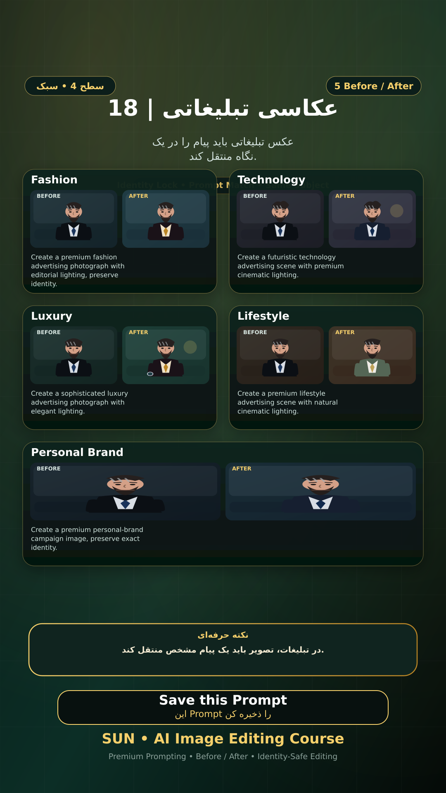

# Story 18 — عکاسی تبلیغاتی

**موضوع:** عکس تبلیغاتی باید پیام را در یک نگاه منتقل کند.

## زمان انتشار
- Instagram: `h.alavian`
- نوع: `Story`
- زمان: `2026-09-17 00:00` به وقت ایران (Asia/Tehran)
- انتشار خودکار: فعال
- محتوای تولید/ویرایش‌شده با AI: بله

## قانون ثابت هویت چهره
> Use the uploaded reference image as the permanent identity anchor. Preserve the exact facial identity, facial structure, proportions, eye shape, eyebrows, nose, lips, jawline, chin, skin tone, apparent age and distinctive facial characteristics. The person must remain instantly recognizable as the same individual. Do not alter identity, ethnicity, age or face shape. Change only the explicitly requested elements.

## پرامپت‌های استفاده‌شده در استوری
1. **Fashion:** `Create a premium fashion advertising photograph with editorial lighting, preserve identity.`
2. **Technology:** `Create a futuristic technology advertising scene with premium cinematic lighting.`
3. **Luxury:** `Create a sophisticated luxury advertising photograph with elegant lighting.`
4. **Lifestyle:** `Create a premium lifestyle advertising scene with natural cinematic lighting.`
5. **Personal Brand:** `Create a premium personal-brand campaign image, preserve exact identity.`

> نکته: در تبلیغات، تصویر باید یک پیام مشخص منتقل کند.
