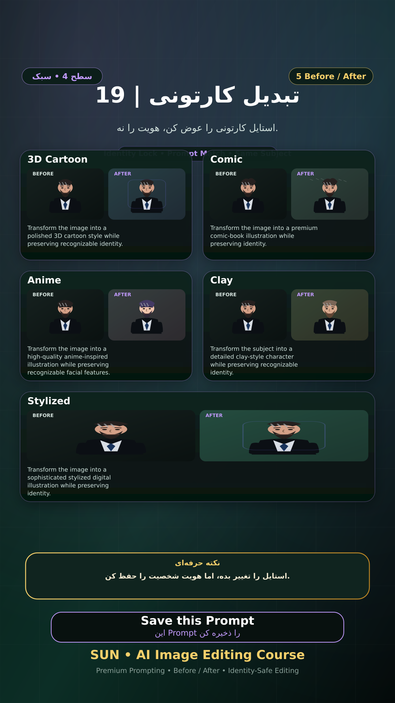

# Story 19 — تبدیل کارتونی

**موضوع:** استایل کارتونی را عوض کن، هویت را نه.

## زمان انتشار
- Instagram: `h.alavian`
- نوع: `Story`
- زمان: `2026-09-17 00:00` به وقت ایران (Asia/Tehran)
- انتشار خودکار: فعال
- محتوای تولید/ویرایش‌شده با AI: بله

## قانون ثابت هویت چهره
> Use the uploaded reference image as the permanent identity anchor. Preserve the exact facial identity, facial structure, proportions, eye shape, eyebrows, nose, lips, jawline, chin, skin tone, apparent age and distinctive facial characteristics. The person must remain instantly recognizable as the same individual. Do not alter identity, ethnicity, age or face shape. Change only the explicitly requested elements.

## پرامپت‌های استفاده‌شده در استوری
1. **3D Cartoon:** `Transform the image into a polished 3D cartoon style while preserving recognizable identity.`
2. **Comic:** `Transform the image into a premium comic-book illustration while preserving identity.`
3. **Anime:** `Transform the image into a high-quality anime-inspired illustration while preserving recognizable facial features.`
4. **Clay:** `Transform the subject into a detailed clay-style character while preserving recognizable identity.`
5. **Stylized:** `Transform the image into a sophisticated stylized digital illustration while preserving identity.`

> نکته: استایل را تغییر بده، اما هویت شخصیت را حفظ کن.
