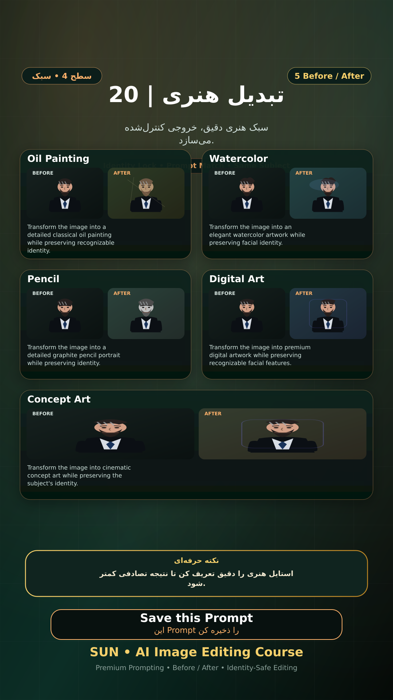

# Story 20 — تبدیل هنری

**موضوع:** سبک هنری دقیق، خروجی کنترل‌شده می‌سازد.

## زمان انتشار
- Instagram: `h.alavian`
- نوع: `Story`
- زمان: `2026-09-17 00:00` به وقت ایران (Asia/Tehran)
- انتشار خودکار: فعال
- محتوای تولید/ویرایش‌شده با AI: بله

## قانون ثابت هویت چهره
> Use the uploaded reference image as the permanent identity anchor. Preserve the exact facial identity, facial structure, proportions, eye shape, eyebrows, nose, lips, jawline, chin, skin tone, apparent age and distinctive facial characteristics. The person must remain instantly recognizable as the same individual. Do not alter identity, ethnicity, age or face shape. Change only the explicitly requested elements.

## پرامپت‌های استفاده‌شده در استوری
1. **Oil Painting:** `Transform the image into a detailed classical oil painting while preserving recognizable identity.`
2. **Watercolor:** `Transform the image into an elegant watercolor artwork while preserving facial identity.`
3. **Pencil:** `Transform the image into a detailed graphite pencil portrait while preserving identity.`
4. **Digital Art:** `Transform the image into premium digital artwork while preserving recognizable facial features.`
5. **Concept Art:** `Transform the image into cinematic concept art while preserving the subject's identity.`

> نکته: استایل هنری را دقیق تعریف کن تا نتیجه تصادفی کمتر شود.
