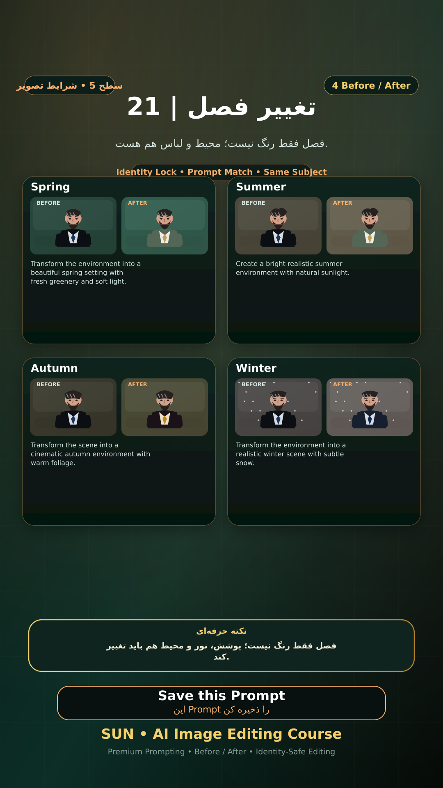

# Story 21 — تغییر فصل

**موضوع:** فصل فقط رنگ نیست؛ محیط و لباس هم هست.

## زمان انتشار
- Instagram: `h.alavian`
- نوع: `Story`
- زمان: `2026-09-17 00:00` به وقت ایران (Asia/Tehran)
- انتشار خودکار: فعال
- محتوای تولید/ویرایش‌شده با AI: بله

## قانون ثابت هویت چهره
> Use the uploaded reference image as the permanent identity anchor. Preserve the exact facial identity, facial structure, proportions, eye shape, eyebrows, nose, lips, jawline, chin, skin tone, apparent age and distinctive facial characteristics. The person must remain instantly recognizable as the same individual. Do not alter identity, ethnicity, age or face shape. Change only the explicitly requested elements.

## پرامپت‌های استفاده‌شده در استوری
1. **Spring:** `Transform the environment into a beautiful spring setting with fresh greenery and soft light.`
2. **Summer:** `Create a bright realistic summer environment with natural sunlight.`
3. **Autumn:** `Transform the scene into a cinematic autumn environment with warm foliage.`
4. **Winter:** `Transform the environment into a realistic winter scene with subtle snow.`

> نکته: فصل فقط رنگ نیست؛ پوشش، نور و محیط هم باید تغییر کند.
