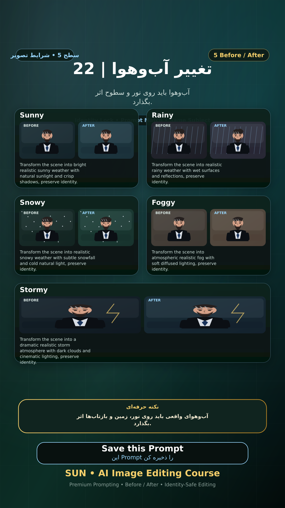

# Story 22 — تغییر آب‌وهوا

**موضوع:** آب‌وهوا باید روی نور و سطوح اثر بگذارد.

## زمان انتشار
- Instagram: `h.alavian`
- نوع: `Story`
- زمان: `2026-09-17 00:00` به وقت ایران (Asia/Tehran)
- انتشار خودکار: فعال
- محتوای تولید/ویرایش‌شده با AI: بله

## قانون ثابت هویت چهره
> Use the uploaded reference image as the permanent identity anchor. Preserve the exact facial identity, facial structure, proportions, eye shape, eyebrows, nose, lips, jawline, chin, skin tone, apparent age and distinctive facial characteristics. The person must remain instantly recognizable as the same individual. Do not alter identity, ethnicity, age or face shape. Change only the explicitly requested elements.

## پرامپت‌های استفاده‌شده در استوری
1. **Sunny:** `Transform the scene into bright realistic sunny weather with natural sunlight and crisp shadows, preserve identity.`
2. **Rainy:** `Transform the scene into realistic rainy weather with wet surfaces and reflections, preserve identity.`
3. **Snowy:** `Transform the scene into realistic snowy weather with subtle snowfall and cold natural light, preserve identity.`
4. **Foggy:** `Transform the scene into atmospheric realistic fog with soft diffused lighting, preserve identity.`
5. **Stormy:** `Transform the scene into a dramatic realistic storm atmosphere with dark clouds and cinematic lighting, preserve identity.`

> نکته: آب‌وهوای واقعی باید روی نور، زمین و بازتاب‌ها اثر بگذارد.
