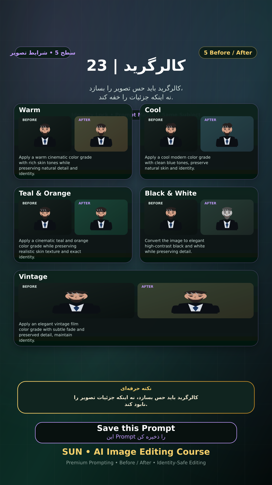

# Story 23 — کالرگرید

**موضوع:** کالرگرید باید حس تصویر را بسازد، نه اینکه جزئیات را خفه کند.

## زمان انتشار
- Instagram: `h.alavian`
- نوع: `Story`
- زمان: `2026-09-17 00:00` به وقت ایران (Asia/Tehran)
- انتشار خودکار: فعال
- محتوای تولید/ویرایش‌شده با AI: بله

## قانون ثابت هویت چهره
> Use the uploaded reference image as the permanent identity anchor. Preserve the exact facial identity, facial structure, proportions, eye shape, eyebrows, nose, lips, jawline, chin, skin tone, apparent age and distinctive facial characteristics. The person must remain instantly recognizable as the same individual. Do not alter identity, ethnicity, age or face shape. Change only the explicitly requested elements.

## پرامپت‌های استفاده‌شده در استوری
1. **Warm:** `Apply a warm cinematic color grade with rich skin tones while preserving natural detail and identity.`
2. **Cool:** `Apply a cool modern color grade with clean blue tones, preserve natural skin and identity.`
3. **Teal & Orange:** `Apply a cinematic teal and orange color grade while preserving realistic skin texture and exact identity.`
4. **Black & White:** `Convert the image to elegant high-contrast black and white while preserving detail.`
5. **Vintage:** `Apply an elegant vintage film color grade with subtle fade and preserved detail, maintain identity.`

> نکته: کالرگرید باید حس بسازد، نه اینکه جزئیات تصویر را نابود کند.
