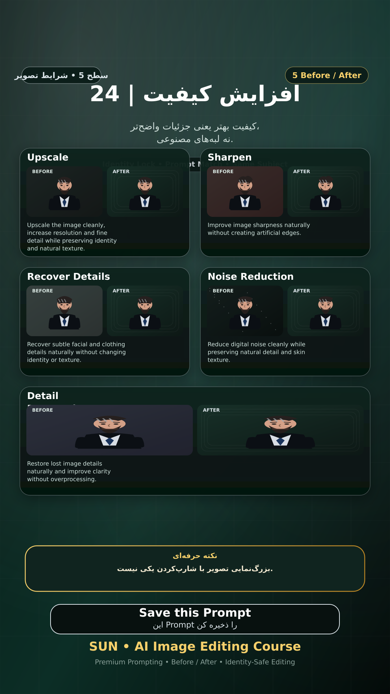

# Story 24 — افزایش کیفیت

**موضوع:** کیفیت بهتر یعنی جزئیات واضح‌تر، نه لبه‌های مصنوعی.

## زمان انتشار
- Instagram: `h.alavian`
- نوع: `Story`
- زمان: `2026-09-17 00:00` به وقت ایران (Asia/Tehran)
- انتشار خودکار: فعال
- محتوای تولید/ویرایش‌شده با AI: بله

## قانون ثابت هویت چهره
> Use the uploaded reference image as the permanent identity anchor. Preserve the exact facial identity, facial structure, proportions, eye shape, eyebrows, nose, lips, jawline, chin, skin tone, apparent age and distinctive facial characteristics. The person must remain instantly recognizable as the same individual. Do not alter identity, ethnicity, age or face shape. Change only the explicitly requested elements.

## پرامپت‌های استفاده‌شده در استوری
1. **Upscale:** `Upscale the image cleanly, increase resolution and fine detail while preserving identity and natural texture.`
2. **Sharpen:** `Improve image sharpness naturally without creating artificial edges.`
3. **Recover Details:** `Recover subtle facial and clothing details naturally without changing identity or texture.`
4. **Noise Reduction:** `Reduce digital noise cleanly while preserving natural detail and skin texture.`
5. **Detail Restoration:** `Restore lost image details naturally and improve clarity without overprocessing.`

> نکته: بزرگ‌نمایی تصویر با شارپ‌کردن یکی نیست.
