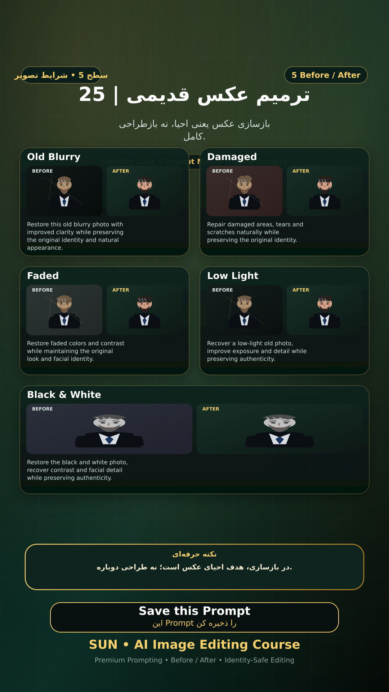

# Story 25 — ترمیم عکس قدیمی

**موضوع:** بازسازی عکس یعنی احیا، نه بازطراحی کامل.

## زمان انتشار
- Instagram: `h.alavian`
- نوع: `Story`
- زمان: `2026-09-17 00:00` به وقت ایران (Asia/Tehran)
- انتشار خودکار: فعال
- محتوای تولید/ویرایش‌شده با AI: بله

## قانون ثابت هویت چهره
> Use the uploaded reference image as the permanent identity anchor. Preserve the exact facial identity, facial structure, proportions, eye shape, eyebrows, nose, lips, jawline, chin, skin tone, apparent age and distinctive facial characteristics. The person must remain instantly recognizable as the same individual. Do not alter identity, ethnicity, age or face shape. Change only the explicitly requested elements.

## پرامپت‌های استفاده‌شده در استوری
1. **Old Blurry:** `Restore this old blurry photo with improved clarity while preserving the original identity and natural appearance.`
2. **Damaged:** `Repair damaged areas, tears and scratches naturally while preserving the original identity.`
3. **Faded:** `Restore faded colors and contrast while maintaining the original look and facial identity.`
4. **Low Light:** `Recover a low-light old photo, improve exposure and detail while preserving authenticity.`
5. **Black & White:** `Restore the black and white photo, recover contrast and facial detail while preserving authenticity.`

> نکته: در بازسازی، هدف احیای عکس است؛ نه طراحی دوباره.
