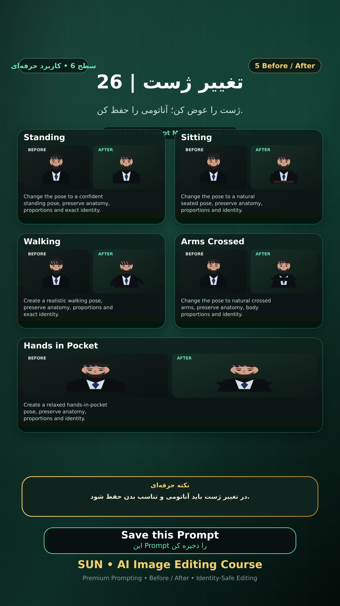

# Story 26 — تغییر ژست

**موضوع:** ژست را عوض کن؛ آناتومی را حفظ کن.

## زمان انتشار
- Instagram: `h.alavian`
- نوع: `Story`
- زمان: `2026-09-17 00:00` به وقت ایران (Asia/Tehran)
- انتشار خودکار: فعال
- محتوای تولید/ویرایش‌شده با AI: بله

## قانون ثابت هویت چهره
> Use the uploaded reference image as the permanent identity anchor. Preserve the exact facial identity, facial structure, proportions, eye shape, eyebrows, nose, lips, jawline, chin, skin tone, apparent age and distinctive facial characteristics. The person must remain instantly recognizable as the same individual. Do not alter identity, ethnicity, age or face shape. Change only the explicitly requested elements.

## پرامپت‌های استفاده‌شده در استوری
1. **Standing:** `Change the pose to a confident standing pose, preserve anatomy, proportions and exact identity.`
2. **Sitting:** `Change the pose to a natural seated pose, preserve anatomy, proportions and identity.`
3. **Walking:** `Create a realistic walking pose, preserve anatomy, proportions and exact identity.`
4. **Arms Crossed:** `Change the pose to natural crossed arms, preserve anatomy, body proportions and identity.`
5. **Hands in Pocket:** `Create a relaxed hands-in-pocket pose, preserve anatomy, proportions and identity.`

> نکته: در تغییر ژست باید آناتومی و تناسب بدن حفظ شود.
