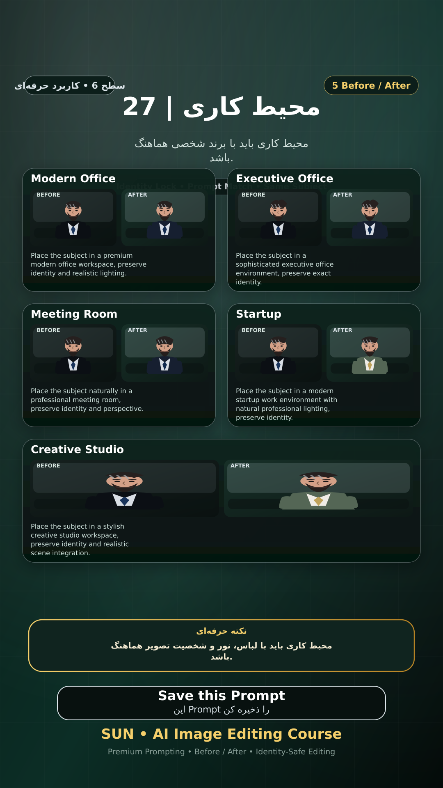

# Story 27 — محیط کاری

**موضوع:** محیط کاری باید با برند شخصی هماهنگ باشد.

## زمان انتشار
- Instagram: `h.alavian`
- نوع: `Story`
- زمان: `2026-09-17 00:00` به وقت ایران (Asia/Tehran)
- انتشار خودکار: فعال
- محتوای تولید/ویرایش‌شده با AI: بله

## قانون ثابت هویت چهره
> Use the uploaded reference image as the permanent identity anchor. Preserve the exact facial identity, facial structure, proportions, eye shape, eyebrows, nose, lips, jawline, chin, skin tone, apparent age and distinctive facial characteristics. The person must remain instantly recognizable as the same individual. Do not alter identity, ethnicity, age or face shape. Change only the explicitly requested elements.

## پرامپت‌های استفاده‌شده در استوری
1. **Modern Office:** `Place the subject in a premium modern office workspace, preserve identity and realistic lighting.`
2. **Executive Office:** `Place the subject in a sophisticated executive office environment, preserve exact identity.`
3. **Meeting Room:** `Place the subject naturally in a professional meeting room, preserve identity and perspective.`
4. **Startup:** `Place the subject in a modern startup work environment with natural professional lighting, preserve identity.`
5. **Creative Studio:** `Place the subject in a stylish creative studio workspace, preserve identity and realistic scene integration.`

> نکته: محیط کاری باید با لباس، نور و شخصیت تصویر هماهنگ باشد.
