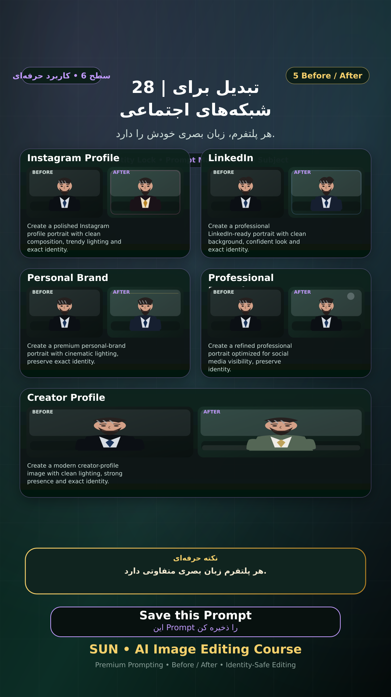

# Story 28 — تبدیل برای شبکه‌های اجتماعی

**موضوع:** هر پلتفرم، زبان بصری خودش را دارد.

## زمان انتشار
- Instagram: `h.alavian`
- نوع: `Story`
- زمان: `2026-09-17 00:00` به وقت ایران (Asia/Tehran)
- انتشار خودکار: فعال
- محتوای تولید/ویرایش‌شده با AI: بله

## قانون ثابت هویت چهره
> Use the uploaded reference image as the permanent identity anchor. Preserve the exact facial identity, facial structure, proportions, eye shape, eyebrows, nose, lips, jawline, chin, skin tone, apparent age and distinctive facial characteristics. The person must remain instantly recognizable as the same individual. Do not alter identity, ethnicity, age or face shape. Change only the explicitly requested elements.

## پرامپت‌های استفاده‌شده در استوری
1. **Instagram Profile:** `Create a polished Instagram profile portrait with clean composition, trendy lighting and exact identity.`
2. **LinkedIn:** `Create a professional LinkedIn-ready portrait with clean background, confident look and exact identity.`
3. **Personal Brand:** `Create a premium personal-brand portrait with cinematic lighting, preserve exact identity.`
4. **Professional Portrait:** `Create a refined professional portrait optimized for social media visibility, preserve identity.`
5. **Creator Profile:** `Create a modern creator-profile image with clean lighting, strong presence and exact identity.`

> نکته: هر پلتفرم زبان بصری متفاوتی دارد.
