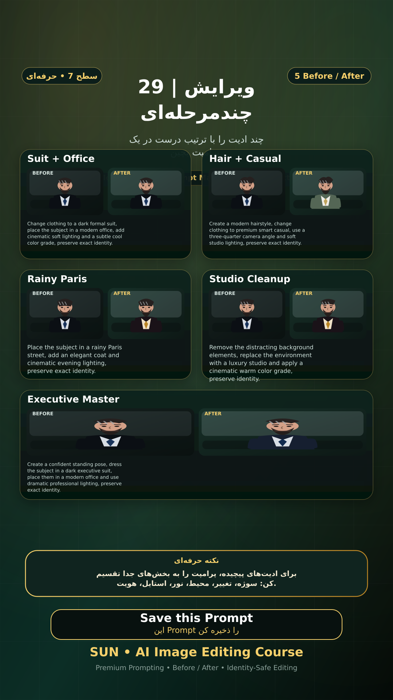

# Story 29 — ویرایش چندمرحله‌ای

**موضوع:** چند ادیت را با ترتیب درست در یک پرامپت بچین.

## زمان انتشار
- Instagram: `h.alavian`
- نوع: `Story`
- زمان: `2026-09-17 00:00` به وقت ایران (Asia/Tehran)
- انتشار خودکار: فعال
- محتوای تولید/ویرایش‌شده با AI: بله

## قانون ثابت هویت چهره
> Use the uploaded reference image as the permanent identity anchor. Preserve the exact facial identity, facial structure, proportions, eye shape, eyebrows, nose, lips, jawline, chin, skin tone, apparent age and distinctive facial characteristics. The person must remain instantly recognizable as the same individual. Do not alter identity, ethnicity, age or face shape. Change only the explicitly requested elements.

## پرامپت‌های استفاده‌شده در استوری
1. **Suit + Office:** `Change clothing to a dark formal suit, place the subject in a modern office, add cinematic soft lighting and a subtle cool color grade, preserve exact identity.`
2. **Hair + Casual:** `Create a modern hairstyle, change clothing to premium smart casual, use a three-quarter camera angle and soft studio lighting, preserve exact identity.`
3. **Rainy Paris:** `Place the subject in a rainy Paris street, add an elegant coat and cinematic evening lighting, preserve exact identity.`
4. **Studio Cleanup:** `Remove the distracting background elements, replace the environment with a luxury studio and apply a cinematic warm color grade, preserve identity.`
5. **Executive Master:** `Create a confident standing pose, dress the subject in a dark executive suit, place them in a modern office and use dramatic professional lighting, preserve exact identity.`

> نکته: برای ادیت‌های پیچیده، پرامپت را به بخش‌های جدا تقسیم کن: سوژه، تغییر، محیط، نور، استایل، هویت.
