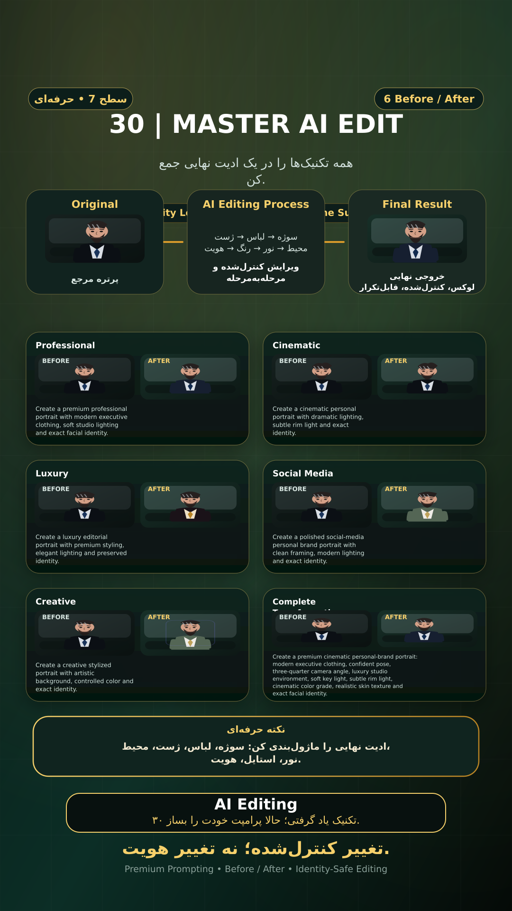

# Story 30 — MASTER AI EDIT

**موضوع:** همه تکنیک‌ها را در یک ادیت نهایی جمع کن.

## زمان انتشار
- Instagram: `h.alavian`
- نوع: `Story`
- زمان: `2026-09-17 00:00` به وقت ایران (Asia/Tehran)
- انتشار خودکار: فعال
- محتوای تولید/ویرایش‌شده با AI: بله

## قانون ثابت هویت چهره
> Use the uploaded reference image as the permanent identity anchor. Preserve the exact facial identity, facial structure, proportions, eye shape, eyebrows, nose, lips, jawline, chin, skin tone, apparent age and distinctive facial characteristics. The person must remain instantly recognizable as the same individual. Do not alter identity, ethnicity, age or face shape. Change only the explicitly requested elements.

## پرامپت‌های استفاده‌شده در استوری
1. **Professional:** `Create a premium professional portrait with modern executive clothing, soft studio lighting and exact facial identity.`
2. **Cinematic:** `Create a cinematic personal portrait with dramatic lighting, subtle rim light and exact identity.`
3. **Luxury:** `Create a luxury editorial portrait with premium styling, elegant lighting and preserved identity.`
4. **Social Media:** `Create a polished social-media personal brand portrait with clean framing, modern lighting and exact identity.`
5. **Creative:** `Create a creative stylized portrait with artistic background, controlled color and exact identity.`
6. **Complete Transformation:** `Create a premium cinematic personal-brand portrait: modern executive clothing, confident pose, three-quarter camera angle, luxury studio environment, soft key light, subtle rim light, cinematic color grade, realistic skin texture and exact facial identity.`

> نکته: ادیت نهایی را ماژول‌بندی کن: سوژه، لباس، ژست، محیط، نور، استایل، هویت.
